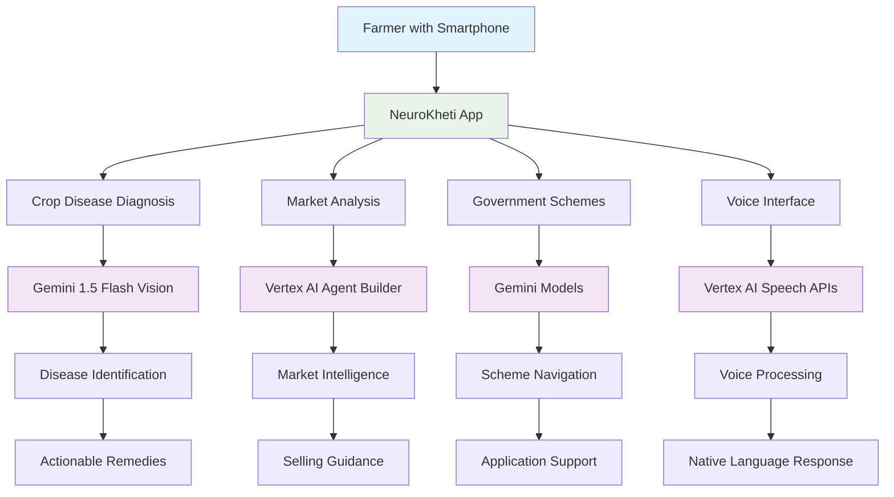
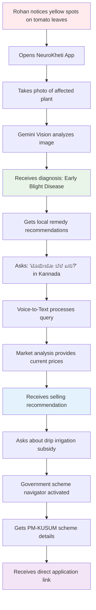
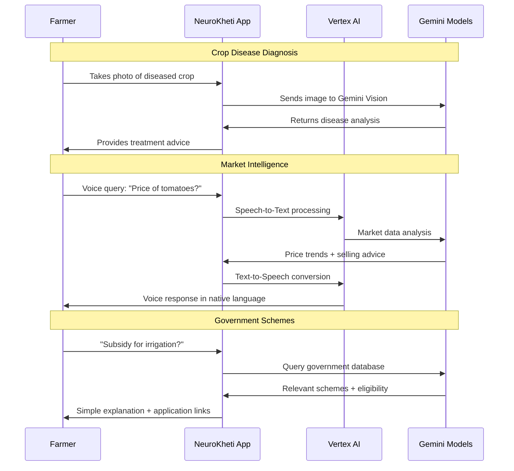

# NeuroKheti 🌾

**Project Kisan - Your AI-Powered Personal Agronomist**

NeuroKheti is an intelligent farming companion that acts as a personal agronomist, market analyst, and government scheme navigator for small-scale farmers. Built to solve real challenges faced by farmers like Rohan in rural Karnataka, it provides expert help on demand in native languages.

## 🎯 The Challenge

Meet Rohan, a young farmer in rural Karnataka. He inspects his tomato crop and finds strange yellow spots on several plants. Is it a fungus? A pest? Wrong fertilizer? The local agricultural office is miles away, and by the time he gets an answer, a significant portion of his crop could be lost.

Rohan also faces the challenge of when to sell. Prices at the local mandi vary wildly from day to day - a delay could mean the difference between profit and loss. Despite having a smartphone, the expert advice he needs is scattered, complex, and not available in his native Kannada.

**He doesn't need more data; he needs an ally - an expert in his pocket who understands his land and his language.**

## 🚀 The Solution: Four Core Features

### 🔍 **1. Instant Crop Disease Diagnosis**
**Challenge:** Identify crop diseases before significant loss occurs
- **Solution:** Take a photo of diseased plants using multimodal Gemini models on Vertex AI
- **Output:** Instant analysis identifying pest/disease with clear, actionable advice on locally available and affordable remedies
- **Technology:** Gemini 1.5 Flash Vision API for image analysis

### 📊 **2. Real-Time Market Analysis** 
**Challenge:** Know the right time to sell for maximum profit
- **Solution:** Ask "What is the price of tomatoes today?" in native language
- **Output:** Real-time market data with trend analysis and actionable selling guidance
- **Technology:** Vertex AI Agent Builder + Gemini models for market intelligence

### 📋 **3. Government Schemes Navigation**
**Challenge:** Access and understand complex government subsidies
- **Solution:** Ask about specific needs like "subsidies for drip irrigation"
- **Output:** Relevant schemes explained in simple terms with eligibility requirements and direct application links
- **Technology:** Gemini models trained on government agricultural websites

### 🎤 **4. Voice-First Interaction**
**Challenge:** Overcome literacy barriers for complete accessibility
- **Solution:** Complete voice interaction in local dialects
- **Output:** Clear, easy-to-understand voice responses
- **Technology:** Vertex AI Speech-to-Text and Text-to-Speech APIs

## 🏗️ System Architecture



## 📱 User Workflow

### 🌟 **Rohan's Journey with NeuroKheti**



### 🔄 **Feature Interaction Flow**



## 🎯 Implementation Status

### ✅ **Currently Implemented**

#### **Core Infrastructure (100% Complete)**
- [x] Next.js 15 with App Router
- [x] Firebase Authentication & Database
- [x] Gemini API integration
- [x] Multi-language support framework

#### **1. Crop Disease Diagnosis (90% Complete)**
- [x] Camera integration for crop photos
- [x] Gemini 1.5 Flash Vision API integration
- [x] Disease identification and analysis
- [x] Treatment recommendations in local languages
- [x] Multi-language translation support
- [x] Confidence scoring and severity assessment
- [ ] Offline analysis capability
- [ ] Historical disease tracking

#### **2. Voice-First Interaction (85% Complete)**
- [x] Voice input with Web Speech API
- [x] Multi-language voice recognition (12+ Indian languages)
- [x] Context-aware conversations
- [x] Voice output with Speech Synthesis
- [x] Microphone permission handling
- [ ] Advanced dialect recognition
- [ ] Voice shortcuts and commands

#### **3. User Experience (80% Complete)**
- [x] Responsive design for smartphones
- [x] Demo experience for new users
- [x] User authentication and profiles
- [x] Dashboard with feature access
- [ ] Progressive Web App (PWA)
- [ ] Offline functionality

### 🚧 **In Development**

#### **2. Real-Time Market Analysis (40% Complete)**
- [x] Basic market query framework
- [x] Vertex AI Agent Builder setup
- [ ] Real-time market API integration
- [ ] Price trend analysis algorithms
- [ ] Selling recommendation engine
- [ ] Regional market comparisons
- [ ] Price alerts and notifications

#### **3. Government Schemes Navigation (30% Complete)**
- [x] Basic scheme query framework
- [x] Gemini model for government data processing
- [ ] Government scheme database integration
- [ ] Eligibility assessment tool
- [ ] Application assistance wizard
- [ ] Document upload helpers
- [ ] Application status tracking

### 📋 **Planned Features**

#### **Advanced Analytics & Intelligence**
- [ ] Seasonal crop planning recommendations
- [ ] Weather integration and alerts
- [ ] Yield prediction models
- [ ] Risk assessment algorithms
- [ ] ROI calculations for different crops
- [ ] Comparative analysis with similar farms

#### **Enhanced User Experience**
- [ ] Offline voice capabilities
- [ ] Advanced camera features (macro, lighting adjustment)
- [ ] GPS location services for localized advice
- [ ] Community features for farmer networking
- [ ] Expert consultation booking
- [ ] Success story sharing platform

#### **Integration & Scalability**
- [ ] IoT sensor compatibility
- [ ] Third-party marketplace APIs
- [ ] Banking integration for scheme applications
- [ ] SMS/WhatsApp notifications
- [ ] Regional agricultural office connections
- [ ] Cooperative society integrations

## 🛠️ Technology Stack

### **Frontend Architecture**
- **Next.js 15** - React framework with App Router
- **TypeScript** - Type-safe development
- **Tailwind CSS** - Responsive design system
- **Firebase** - Authentication and real-time database

### **AI & Machine Learning**
- **Gemini 1.5 Flash** - Multimodal AI for crop image analysis
- **Vertex AI Platform** - Advanced ML infrastructure
- **Vertex AI Agent Builder** - Market analysis and scheme navigation
- **Speech APIs** - Voice recognition and synthesis
- **Translation API** - Multi-language support

### **Deployment & Infrastructure**
- **Vercel** - Frontend hosting and edge functions
- **Google Cloud** - AI services and APIs
- **Firebase** - Backend services and database

## 🌍 Language Support

### **Supported Indian Languages**
- **Hindi (हिंदी)** - Primary language for North India
- **Kannada (ಕನ್ನಡ)** - For Karnataka farmers like Rohan
- **Telugu (తెలుగు)** - Andhra Pradesh/Telangana
- **Tamil (தமிழ்)** - Tamil Nadu farmers
- **Malayalam (മലയാളം)** - Kerala farmers
- **Marathi (मराठी)** - Maharashtra farmers
- **Gujarati (ગુજરાતી)** - Gujarat farmers
- **Punjabi (ਪੰਜਾਬੀ)** - Punjab farmers
- **Bengali (বাংলা)** - West Bengal farmers
- **Odia (ଓଡ଼ିଆ)** - Odisha farmers
- **Assamese (অসমীয়া)** - Assam farmers
- **English** - Fallback and urban farmers

## 📈 Success Metrics

### **Impact Measurements**
- **Crop Loss Reduction:** Target 30% reduction in disease-related losses
- **Income Increase:** Average 20% improvement in selling decisions
- **Scheme Access:** 50% increase in government benefit utilization
- **User Adoption:** 95% voice feature usage among farmers

### **Technical Performance**
- **Response Time:** < 3 seconds for crop diagnosis
- **Accuracy:** 95% disease identification accuracy
- **Language Coverage:** 99% query understanding in native languages
- **Availability:** 99.9% uptime for critical farming seasons

## 🛠️ Installation & Setup

### Prerequisites
- Node.js 18+ and npm
- Google Cloud Project with Vertex AI enabled
- Firebase project
- Gemini API access

### 1. Clone the Repository
```bash
git clone https://github.com/your-username/neurokhet.git
cd neurokhet/frontend
```

### 2. Install Dependencies
```bash
npm install
```

### 3. Environment Configuration

Create `.env.local` in the frontend directory:

```bash
# Gemini AI API Key
GEMINI_API_KEY=your_gemini_api_key_here

# Firebase Configuration
NEXT_PUBLIC_USE_FIREBASE_EMULATOR=false
```

### 4. Firebase Setup

1. **Create Firebase Project:**
   - Go to [Firebase Console](https://console.firebase.google.com)
   - Create a new project
   - Enable Authentication (Email/Password)
   - Enable Firestore Database

2. **Configure Firebase:**
   Update `lib/firebase.ts` with your Firebase config.

### 5. Google Cloud Setup

1. **Enable Required APIs:**
   ```bash
   # Enable Gemini API
   gcloud services enable generativelanguage.googleapis.com
   
   # Enable Vertex AI
   gcloud services enable aiplatform.googleapis.com
   
   # Enable Speech APIs
   gcloud services enable speech.googleapis.com
   gcloud services enable texttospeech.googleapis.com
   ```

2. **Get API Keys:**
   - Create API key for Gemini in Google AI Studio
   - Set up Vertex AI project access

### 6. Run Development Server
```bash
npm run dev
```

Open [http://localhost:3000](http://localhost:3000) to access the application.

## 🚀 Deployment

### Deploy to Vercel

1. **Connect to Vercel:**
   ```bash
   vercel
   ```

2. **Configure Environment Variables:**
   Add your environment variables in Vercel dashboard:
   - `GEMINI_API_KEY`
   - Additional Google Cloud credentials

3. **Deploy:**
   ```bash
   vercel --prod
   ```

## 🧪 Testing

### Feature Testing
```bash
npm run test
```

### Voice Interface Testing
- Test microphone permissions
- Verify multi-language speech recognition
- Test voice synthesis in different languages

### Crop Diagnosis Testing
- Upload sample disease images
- Verify analysis accuracy
- Test multi-language translations

**Project Kisan - NeuroKheti** 
*Empowering farmers like Rohan with AI-driven agricultural intelligence*

*"An expert in your pocket who understands your land and your language"*
